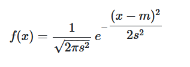

<div align="center">
  
</div>

<br/>
<br/>

<h1 align="center">📋 C02 -  Entrada e Saída</h1>

<!-- ----- EXERCÍCIO ----- -->

## 🚀 [ES - Soma](ES-Soma.cpp)

<h3>Descrição</h3>
<p>
  Leia 2 valores inteiros e armazene-os nas variáveis A e B. Efetue a soma de A e B atribuindo
  o seu resultado na variável X. Imprima X conforme exemplo apresentado abaixo. Não apresente
  mensagem alguma além daquilo que está sendo especificado.
</p>

<details>
  <summary><strong>Entrada & Saída</strong></summary>

  <h3>Entrada</h3>
  <p>
    A entrada contém 2 valores inteiros.
  </p>

  <h3>Saída</h3>
  <p>
  Imprima a variável X conforme exemplo abaixo, com um espaço em branco antes e depois da igualdade.

  Obs: O X está em maiúsculo e deve ter um espaço antes e um espaço depois do sinal de igualdade.
  </p>

  <h3>Exemplos</h3>

  ```
  ** Input **
  10 9

  ** Output **
  X = 19
  ```

</details>
<br/>

---

<!-- ----- EXERCÍCIO ----- -->

## 🚀 [ES - Área de um circulo](ES-Area_de_um_circulo.cpp)

<h3>Descrição</h3>
<p>
  Faça um programa que leia o valor do raio de um círculo e retorne sua área.
</p>

<details>
  <summary><strong>Entrada & Saída</strong></summary>

  <h3>Entrada</h3>
  <p>
    A entrada contém um valor real.
  </p>

  <h3>Saída</h3>
  <p>
    Na saída, o programa deve mostrar a mensagem "AREA = valor_da_area", onde valor_da_area é o valor da área do círculo, com 3 casas decimais. Considere pi = 3.14159.
  </p>

  <h3>Exemplos</h3>

  ```
  ** Input **
  2

  ** Output **
  AREA = 12.566
  ```

</details>
<br/>

---

<!-- ----- EXERCÍCIO ----- -->

## 🚀 [ES - Salário](ES-Salario.cpp)

<h3>Descrição</h3>
<p>
  Escreva um programa que leia o número de um funcionário, seu número de horas trabalhadas, o valor que recebe por hora e calcula o salário desse funcionário. A seguir, mostre o número e o salário do funcionário, com duas casas decimais.
</p>

<details>
  <summary><strong>Entrada & Saída</strong></summary>

  <h3>Entrada</h3>
  <p>
    O arquivo de entrada contém 2 números inteiros e 1 número com duas casas decimais, representando o número, quantidade de horas trabalhadas e o valor que o funcionário recebe por hora trabalhada, respectivamente.
  </p>

  <h3>Saída</h3>
  <p>
    Imprima o número e o salário do funcionário, conforme exemplo fornecido, com um espaço em branco antes e depois da igualdade. No caso do salário, também deve haver um espaço em branco após o $.
  </p>

  <h3>Exemplos</h3>

  ```
  ** Input **
  25 100 5.50

  ** Output **
  NUMBER = 25

  SALARY = U$ 550.00
  ```

</details>
<br/>

---

<!-- ----- EXERCÍCIO ----- -->

## 🚀 [ES - Áreas](ES-Areas.cpp)

<h3>Descrição</h3>
<p>
  Escreva um programa que leia três valores com ponto flutuante de dupla precisão: A, B e C. Em seguida, calcule e mostre:

  a) a área do triângulo retângulo que tem A por base e C por altura.
  b) a área do círculo de raio C. (pi = 3.14159)
  c) a área do trapézio que tem A e B por bases e C por altura.
  d) a área do quadrado que tem lado B.
  e) a área do retângulo que tem lados A e B.
</p>

<details>
  <summary><strong>Entrada & Saída</strong></summary>

  <h3>Entrada</h3>
  <p>
    O arquivo de entrada contém três valores com um dígito após o ponto decimal.
  </p>

  <h3>Saída</h3>
  <p>
    O arquivo de saída deverá conter 5 linhas de dados. Cada linha corresponde a uma das áreas descritas acima, sempre com mensagem correspondente e um espaço entre os dois pontos e o valor. O valor calculado deve ser apresentado com 3 dígitos após o ponto decimal.
  </p>

  <h3>Exemplos</h3>

  ```
  ** Input **
  3.0 4.0 5.2

  12.7 10.4 15.2

  ** Output **
  TRIANGULO: 7.800
  CIRCULO: 84.949
  TRAPEZIO: 18.200
  QUADRADO: 16.000
  RETANGULO: 12.000

  TRIANGULO: 96.520
  CIRCULO: 725.833
  TRAPEZIO: 175.560
  QUADRADO: 108.160
  RETANGULO: 132.080
  ```

</details>
<br/>

---

<!-- ----- EXERCÍCIO ----- -->

## 🚀 [ES - Qual é o troco?](ES-Qual_e_o_troco.cpp)

<h3>Descrição</h3>
<p>
  Zezinho ainda é muito novo para fazer contas, mas já é muito esperto para mexer em apps de celular.

  Precisamos então que você desenvolva um programa que leia quanto dinheiro ele está levando, o preço total da compra, e calcule o troco que o vendedor deve dar ao Zezinho.
</p>

<details>
  <summary><strong>Entrada & Saída</strong></summary>

  <h3>Entrada</h3>
  <p>
    O arquivo de entrada contém 2 números reais, que correspondem ao total de dinheiro que o Zezinho está levando, e o preço total da compra, respectivamente.
  </p>

  <h3>Saída</h3>
  <p>
  Imprima o valor do troco devido pelo vendedor ao Zezinho. A saída deve ter 2 casas depois da vírgula.

  IMPORTANTE: não se esqueça de colocar o endl ao final da saída, para não receber "Presentation Error".
  </p>

  <h3>Exemplos</h3>

  ```
  ** Input **
  20.0 10.0

  10.0 5.50

  50.0 14.30

  ** Output **
  TROCO = 10.00

  TROCO = 4.50

  TROCO = 35.70
  ```

</details>
<br/>

---

<!-- ----- EXERCÍCIO ----- -->

## 🚀 [ES - Aplicando no mercado financeiro](ES-Aplicando_no_mercado_financeiro.cpp)

<h3>Descrição</h3>
<p>
  O atual sistema financeiro utiliza o regime de juros compostos, pois ele oferece uma maior rentabilidade se comparado com o regime de juros simples, em que o valor dos rendimentos torna-se fixo. O juro composto incide mês a mês de acordo com o somatório acumulativo do capital com o rendimento mensal, isto é, prática do juro sobre juro. As modalidades de investimentos e financiamentos são calculadas de acordo com esse modelo de investimento, pois ele oferece um maior rendimento, originando mais lucro.

  Uma expressão matemática utilizada no cálculo dos juros compostos é a seguinte:

  M = C * (1 + i)^t

  M: montante
  C: capital
  i: taxa de juros
  t: tempo de aplicação
</p>

<details>
  <summary><strong>Entrada & Saída</strong></summary>

  <h3>Entrada</h3>
  <p>
    O arquivo de entrada contém 2 números reais, que correspondem ao capital inicial e à taxa de juros (em % ao mês), respectivamente, e um inteiro, que corresponde ao tempo de aplicação, em meses.
  </p>

  <h3>Saída</h3>
  <p>
    A saída deve mostrar o lucro obtido sobre o capital. Este valor deve ser mostrado com 2 casas decimais.
  </p>

  <h3>Exemplos</h3>

  ```
  ** Input **
  7000.0 1.5 12

  12000.0 1.35 10

  ** Output **
  LUCRO = 1369.33

  LUCRO = 1722.04
  ```

</details>
<br/>

---

<!-- ----- EXERCÍCIO ----- -->

## 🚀 [ES-  Gaussiana](ES-Gaussiana.cpp)

<h3>Descrição</h3>
<p>
  A distribuição gaussiana é uma das mais importantes, pois modela vários fenômenos físicos de interesse como o ruído de canal, a estimação de erros, etc.

  Ela possui dois parâmetros:

  - a média m

  - o desvio padrão s

  e pode ser calculada pela expressão:

  

  Faça um programa que leia os valores de x, m e s , e mostre o valor de f(x).

  Considere π = 3.14159.
</p>

<details>
  <summary><strong>Entrada & Saída</strong></summary>

  <h3>Entrada</h3>
  <p>
    As entradas consistem em 3 números reais, correspondentes a x, m e s, respectivamente.
  </p>

  <h3>Saída</h3>
  <p>
    Na saída, o programa deve mostrar o valor de f(x), com 4 casas decimais.
  </p>

  <h3>Exemplos</h3>

  ```
  ** Input **
  1.0 0.0 1.0

  ** Output **
  0.2420
  ```

</details>
<br/>
