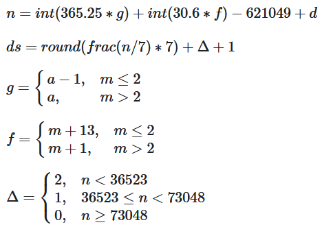

<div align="center">
  
</div>

<br/>
<br/>

<h1 align="center">📋 C02 - Estruturas de Seleção</h1>

<!-- ----- EXERCÍCIO ----- -->

## 🚀 [IF - Teste de seleção 1](IF-Teste_de_selecao_1.cpp)

<h3>Descrição</h3>
<p>
  Leia 4 valores inteiros A, B, C e D. Então, se B for maior que C e D for maior que A e se a soma de C e D for maior que a soma de A e B e se C e D forem valores positivos e se A for par, escreva a mensagem “Valores aceitos”. Caso contrário, escreva a mensagem “Valores nao aceitos”.
</p>

<details>
  <summary><strong>Entrada & Saída</strong></summary>

  <h3>Entrada</h3>
  <p>
    Quatro números inteiros A, B, C e D.
  </p>

  <h3>Saída</h3>
  <p>
    Mostre a mensagem correspondente após a validação dos valores​​.
  </p>

  <h3>Exemplos</h3>

  ```
  ** Input **
  5 6 7 8

  2 3 2 6

  ** Output **
  Valores nao aceitos

  Valores aceitos
  ```

</details>
<br/>

---

<!-- ----- EXERCÍCIO ----- -->

## 🚀 [IF - Intervalo](IF-Intervalo.cpp)

<h3>Descrição</h3>
<p>
  Você deve fazer um programa que leia um valor qualquer e apresente uma mensagem dizendo em qual dos seguintes intervalos [0, 25], (25, 50], (50, 75], (75, 100] este valor se encontra. Obviamente se o valor não estiver em nenhum destes intervalos, deverá ser impressa a mensagem “Fora de intervalo”.
</p>

<details>
  <summary><strong>Entrada & Saída</strong></summary>

  <h3>Entrada</h3>
  <p>
    O arquivo de entrada contém um número com ponto flutuante qualquer.
  </p>

  <h3>Saída</h3>
  <p>
    A saída deve ser uma mensagem conforme exemplo abaixo.
  </p>

  <h3>Exemplos</h3>

  ```
  ** Input **
  25.01
  25.00
  100.00
  -25.02

  ** Output **
  Intervalo (25,50]
  Intervalo [0,25]
  Intervalo (75,100]
  Fora de intervalo
  ```

</details>
<br/>

---

<!-- ----- EXERCÍCIO ----- -->

## 🚀 [IF - Lanche](IF-Lanche.cpp)

<h3>Descrição</h3>
<p>
  Com base na tabela abaixo, escreva um programa que leia o código de um item e a quantidade deste item. A seguir, calcule e mostre o valor da conta a pagar.
</p>

| Código | Especificação   | Preço   |
| ------ | --------------- | ------- |
| 1      | Cachorro Quente | R$ 4.00 |
| 2      | X-Salada        | R$ 4.50 |
| 3      | X-Beacon        | R$ 5.00 |
| 4      | Torrada simples | R$ 2.00 |
| 5      | Refrigerante    | R$ 1.50 |

<details>
  <summary><strong>Entrada & Saída</strong></summary>

  <h3>Entrada</h3>
  <p>
    O arquivo de entrada contém dois valores inteiros correspondentes ao código e à quantidade de um item conforme tabela acima.
  </p>

  <h3>Saída</h3>
  <p>
    O arquivo de saída deve conter a mensagem "Total: R$ " seguido pelo valor a ser pago, com 2 casas após o ponto decimal.
  </p>

  <h3>Exemplos</h3>

  ```
  ** Input **
  3 2
  4 3
  2 3

  ** Output **
  Total: R$ 10.00
  Total: R$ 6.00
  Total: R$ 13.50
  ```

</details>
<br/>

---

<!-- ----- EXERCÍCIO ----- -->

## 🚀 [IF - Coordenadas de um ponto](IF-Coordenadas_de_um_ponto.cpp)

<h3>Descrição</h3>
<p>
  Leia 2 valores com uma casa decimal (x e y), que devem representar as coordenadas de um ponto em um plano. A seguir, determine qual o quadrante ao qual pertence o ponto, ou se está sobre um dos eixos cartesianos ou na origem (x = y = 0).

  Se o ponto estiver na origem, escreva a mensagem “Origem”.

  Se o ponto estiver sobre um dos eixos escreva “Eixo X” ou “Eixo Y”, conforme for a situação.
</p>

<details>
  <summary><strong>Entrada & Saída</strong></summary>

  <h3>Entrada</h3>
  <p>
    A entrada contem as coordenadas de um ponto.
  </p>

  <h3>Saída</h3>
  <p>
    A saída deve apresentar o quadrante em que o ponto se encontra.
  </p>

  <h3>Exemplos</h3>

  ```
  ** Input **
  4.5 -2.2
  0.1 0.1
  0.0 0.0

  ** Output **
  Q4
  Q1
  Origem
  ```

</details>
<br/>

---

<!-- ----- EXERCÍCIO ----- -->

## 🚀 [IF - Ordenação simples](IF-Ordenacao_simples.cpp)

<h3>Descrição</h3>
<p>
  Leia 3 valores inteiros e ordene-os em ordem crescente. No final, mostre os valores em ordem crescente, uma linha em branco e em seguida, os valores na sequência como foram lidos.
</p>

<details>
  <summary><strong>Entrada & Saída</strong></summary>

  <h3>Entrada</h3>
  <p>
    A entrada contem três números inteiros.
  </p>

  <h3>Saída</h3>
  <p>
    Imprima a saída conforme foi especificado.
  </p>

  <h3>Exemplos</h3>

  ```
  ** Input **
  7 21 -14

  -14 21 7

  ** Output **
  -14
  7
  21

  7
  21
  -14

  -14
  7
  21

  -14
  21
  7
  ```

</details>
<br/>

---

<!-- ----- EXERCÍCIO ----- -->

## 🚀 [IF - DDD](IF-DDD.cpp)

<h3>Descrição</h3>
<p>
  Leia um número inteiro que representa um código de DDD para discagem interurbana. Em seguida, informe à qual cidade o DDD pertence, considerando a tabela abaixo:
</p>

| DDD | Cidade         |
| --- | -------------- |
| 61  | Brasilia       |
| 71  | Salvador       |
| 11  | Sao Paulo      |
| 21  | Rio de Janeiro |
| 32  | Juiz de Fora   |
| 19  | Campinas       |
| 27  | Vitoria        |
| 31  | Belo Horizonte |

<p>
  Se a entrada for qualquer outro DDD que não esteja presente na tabela acima, o programa deverá informar:
  DDD nao cadastrado
</p>

<details>
  <summary><strong>Entrada & Saída</strong></summary>

  <h3>Entrada</h3>
  <p>
    A entrada consiste de um único valor inteiro.
  </p>

  <h3>Saída</h3>
  <p>
    Imprima o nome da cidade correspondente ao DDD existente na entrada. Imprima DDD nao cadastrado caso não existir DDD correspondente ao número digitado.
  </p>

  <h3>Exemplos</h3>

  ```
  ** Input **
  11

  31

  45

  ** Output **
  Sao Paulo

  Belo Horizonte

  DDD nao cadastrado
  ```

</details>
<br/>

---

<!-- ----- EXERCÍCIO ----- -->

## 🚀 [IF - Taxas](IF-Taxas.cpp)

<h3>Descrição</h3>
<p>
  Em um país imaginário denominado Lisarb, todos os habitantes ficam felizes em pagar seus impostos, pois sabem que nele não existem políticos corruptos e os recursos arrecadados são utilizados em benefício da população, sem qualquer desvio. A moeda deste país é o Rombus, cujo símbolo é o R$.

  Leia um valor com duas casas decimais, equivalente ao salário de uma pessoa de Lisarb. Em seguida, calcule e mostre o valor que esta pessoa deve pagar de Imposto de Renda, segundo a tabela abaixo.

  | Renda                    | Imposto de Renda |
  | ------------------------ | ---------------- |
  | <= R$ 2.000              | Isento           |
  | R$ 2.000 < x <= R$ 3.000 | 8%               |
  | R$ 3.000 < x <= R$ 4.500 | 18%              |
  | >= R$ 4.500              | 28%              |

  Lembre que, se o salário for R$ 3002.00, a taxa que incide é de 8% apenas sobre R$ 1000.00, pois a faixa de salário que fica de R$ 0.00 até R$ 2000.00 é isenta de Imposto de Renda. No exemplo fornecido (abaixo), a taxa é de 8% sobre R$ 1000.00 + 18% sobre R$ 2.00, o que resulta em R$ 80.36 no total. O valor deve ser impresso com duas casas decimais.
</p>

<details>
  <summary><strong>Entrada & Saída</strong></summary>

  <h3>Entrada</h3>
  <p>
    A entrada contém apenas um valor de ponto flutuante, com duas casas decimais.
  </p>

  <h3>Saída</h3>
  <p>
    Imprima o texto "R$" seguido de um espaço e do valor total devido de Imposto de Renda, com duas casas após o ponto. Se o valor de entrada for menor ou igual a 2000, deverá ser impressa a mensagem "Isento".
  </p>

  <h3>Exemplos</h3>

  ```
  ** Input **
  3002.00

  1701.12

  4520.00

  ** Output **
  R$ 80.36

	Isento

  R$ 355.60
  ```

</details>
<br/>

---

<!-- ----- EXERCÍCIO ----- -->

## 🚀 [IF - Mês](IF-Mes.cpp)

<h3>Descrição</h3>
<p>
  Leia um valor inteiro entre 1 e 12, inclusive. Correspondente a este valor, deve ser apresentado como resposta o mês do ano por extenso, em inglês, com a primeira letra maiúscula.
</p>

<details>
  <summary><strong>Entrada & Saída</strong></summary>

  <h3>Entrada</h3>
  <p>
    A entrada contém um único valor inteiro.
  </p>

  <h3>Saída</h3>
  <p>
    Imprima por extenso o nome do mês (em inglês) correspondente ao número existente na entrada, com a primeira letra em maiúscula.
  </p>

  <h3>Exemplos</h3>

  ```
  ** Input **
  1

  ** Output **
  January
  ```

</details>
<br/>

---

<!-- ----- EXERCÍCIO ----- -->

## 🚀 [IF-Fórmula de Baskara](IF-Formula_de_Baskara.cpp)

<h3>Descrição</h3>
<p>
  Leia 3 valores A, B e C de ponto flutuante, correspondentes aos coeficientes de uma equação do segundo grau, e efetue o cálculo de suas raízes.

  Se não for possível calcular as raízes, mostre a mensagem correspondente “Impossivel calcular”,

  caso haja uma divisão por 0 ou raiz de numero negativo.
</p>

<details>
  <summary><strong>Entrada & Saída</strong></summary>

  <h3>Entrada</h3>
  <p>
    Leia três valores de ponto flutuante (double) A, B e C.
  </p>

  <h3>Saída</h3>
  <p>
  Se não houver possibilidade de calcular as raízes, apresente a mensagem "Impossivel calcular".

  Caso contrário, imprima o resultado das raízes com 5 dígitos após o ponto, com uma mensagem

  correspondente conforme exemplo abaixo. Imprima sempre o final de linha após cada mensagem.
  </p>

  <h3>Exemplos</h3>

  ```
  ** Input **
  10.0 20.1 5.1

  0.0 20.0 5.0

  10.0 3.0 5.0

  10.3 203.0 5.0

  ** Output **
  R1 = -0.29788
  R2 = -1.71212

  Impossivel calcular

  Impossivel calcular

  R1 = -0.02466
  R2 = -19.68408
  ```

</details>
<br/>

---

<!-- ----- EXERCÍCIO ----- -->

## 🚀 [IF - Dia da semana](IF-Dia_da_semana.cpp)

<h3>Descrição</h3>
<p>
  Sabe-se que o dia da semana de uma data fornecida entre 1o de março de 1700 e 28 de fevereiro de 2100 pode ser determinado através do seguinte método:
</p>



<p>
  O dia da semana (ds) é representado por 1 se for domingo, 2 se for segunda-feira, e assim por diante. Faça um programa que leia o dia, mês e ano e forneça o dia da semana correspondente.
</p>

<details>
  <summary><strong>Entrada & Saída</strong></summary>

  <h3>Entrada</h3>
  <p>
    A entrada consiste uma única linha com três números inteiros, que correspondem respectivamente ao dia, mês e ano.
  </p>

  <h3>Saída</h3>
  <p>
    A saída deve mostrar o menor o dia da semana correspondente à data inserida.
  </p>

  <h3>Exemplos</h3>

  ```
  ** Input **
  18 05 1967
  18 08 2018
  2 1 2018

  ** Output **
  quinta-feira
  sabado
  terca-feira
  ```

</details>
<br/>

---

<!-- ----- EXERCÍCIO ----- -->

## 🚀 [IF - Elevador](IF-Elevador.cpp)

<h3>Descrição</h3>
<p>
  A FCC (Fábrica de Cilindros de Carbono) fabrica vários tipos de cilindros de carbono. A FCC é instalada no décimo andar de um edifício e usa os vários elevadores do edifício para transportar os cilindros. Por segurança, os cilindros devem ser transportados na posição vertical e, como são pesados, no máximo dois cilindros podem ser transportados em uma única viagem de elevador. Os elevadores têm a forma de um paralelepípedo e sua altura é sempre maior que a altura dos cilindros.

  Para minimizar o número de viagens de elevador para transportar os cilindros, a FCC deseja, sempre que possível, colocar dois cilindros no elevador. A figura abaixo ilustra esquematicamente (vista superior) um caso em que isso é possível (a) e um caso em que isso não é possível (b):
</p>


<p>
  Como há uma quantidade muito grande de elevadores e tipos de cilindros, a FCC contratou você para escrever um programa que, dadas as dimensões do elevador e dos dois cilindros, determine se é possível colocar os dois cilindros no elevador.
</p>

<details>
  <summary><strong>Entrada & Saída</strong></summary>

  <h3>Entrada</h3>
  <p>
    A entrada contém uma única linha com quatro números inteiros L, C, R1 e R2, separados por espaços em branco, indicando a largura (1 ≤ L ≤ 100) e o comprimento (1 ≤ C ≤ 100) do elevador e o raio dos cilindros (1 ≤ R1, R2 ≤ 100).
  </p>

  <h3>Saída</h3>
  <p>
    Seu programa deve imprimir uma única linha com um único caractere, `S 'se você puder colocar os dois cilindros no elevador e` N' caso contrário.
  </p>

  <h3>Exemplos</h3>

  ```
  ** Input **
  11 9 2 3

  7 8 3 2

  10 15 3 7

  8 9 3 2

  ** Output **
  S

  N

  N

  S
  ```

</details>
<br/>

---

<!-- ----- EXERCÍCIO ----- -->

## 🚀 [IF - Desafio Círculos](IF-Desafio_Circulos.cpp)

<h3>Descrição</h3>
<p>
  Escreva um programa que receba como entrada as coordenadas dos centros e os raios de dois círculos em um plano 2D. O programa deve calcular e exibir a área da intersecção desses dois círculos. Se os círculos não se intersectarem, o programa deve exibir 0.

  Se os círculos tiverem uma intersecção, a área desta pode ser calculada usando a fórmula:
</p>


<p>
 onde d é a distância entre os centros dos círculos, r é o raio do menor círculo, e R é o raio do maior círculo.
</p>

<details>
  <summary><strong>Entrada & Saída</strong></summary>

  <h3>Entrada</h3>
  <p>
  A entrada consiste de duas linhas:

  Na primeira linha serão digitados 3 números reais, x1, y1 e r1, que correspondem às cordenadas x e y do centro  e ao raio do primeiro círculo, respectivamente.

  A segunda linha irá conter mais três números reais, x2, y2 e r2, que correspondem às cordenadas e do centro x e y ao raio do segundo círculo, respectivamente.
  </p>

  <h3>Saída</h3>
  <p>
    Na saída, o programa deve mostrar a área da intersecção entre os dois círculos, com 2 casas decimais. Se não houver intersecção, o programa deverá retornar 0.
  </p>

  <h3>Exemplos</h3>

  ```
  ** Input **
  0 0 1
  3 0 1

  0 0 1
  2 0 1

  0 0 2
  2 0 2

  0 0 2
  3 0 3

  ** Output **
  0

  0

  4.91

  5.38
  ```

</details>
<br/>

---

<!-- ----- EXERCÍCIO ----- -->

## 🚀 [IF - Equipes de Projeto](IF-Equipes_de_Projeto.cpp)

<h3>Descrição</h3>
<p>
  Há N alunos em uma turma e o professor deseja dividir esses alunos em alguns grupos. O professor disse que não são permitidos grupos compostos por dois ou menos alunos, então o professor deseja ter o maior número possível de grupos compostos por três ou mais alunos. Divida os alunos de forma que o número de grupos compostos por três ou mais alunos seja maximizado.
</p>

<details>
  <summary><strong>Entrada & Saída</strong></summary>

  <h3>Entrada</h3>
  <p>
    A entrada consiste de um único inteiro N (1 <= N < 100000).
  </p>

  <h3>Saída</h3>
  <p>
    Na saída, o programa deve mostrar o maior número de grupos que podem ser formados
  </p>

  <h3>Exemplos</h3>

  ```
  ** Input **
  6

  ** Output **
  2
  ```

</details>
<br/>
