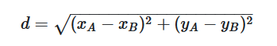

<div align="center">

<br/>
<br/>
<h1>📋 C02 - NP3</h1>
</div>

## 🏗️ [PROVA - STRUCT - 1](PROVA-STRUCT_1.cpp)

<h3>Descrição</h3>
<p>
Faça um código em C++ que leia as coordenadas x e y de dois pontos no plano cartesiano e armazene estes dados em um vetor de structs.

A struct deve ter a forma:
```CPP
struct ponto {
    int x, y;
};
```

Depois, o programa deve calcular a distância euclidiana entre estes dois pontos, mostrando o resultado na tela.

Se as coordenadas do ponto A são (xA,yA), e as coordenadas do ponto B são (xB,yB), então a distância euclidiana entre os pontos A e B é dada por:

<div align="center">

</div>

</p>

<details>
  <summary><strong>Entrada & Saída</strong></summary>
  <h3>Entrada</h3>
  <p>
  A entrada consiste de uma única linha, com quatro números reais xa, ya, xb, yb, que correspondem às coordenadas x e y dos pontos A e B, respectivamente.
  </p>
  <h3>Saída</h3>
  <p>
  Na saída, o programa deve mostrar a distância euclidiana entre A e B, com duas casas decimais.
  </p>
  <h3>Exemplos</h3>

  ```
  ** Input **
  2 3 1 6

  ** Output **
  3.16
  ```

</details>

<br/>

<!-- ----- EXERCÍCIO ----- -->

<br/>

## 📊 [PROVA - FUNC+VET - 1](PROVA-FUNC+VET_1.cpp)

<h3>Descrição</h3>
<p>
Uma das medidas importantes na área de meteorologia é a temperatura média em um dado intervalo de dias. Faça um programa que leia várias leituras de temperatura e as armazene em um vetor de números reais. Depois o programa deve mostrar a temperatura média deste período. Faça uma função que receba as leituras e retorne a média das mesmas. Esta função deve ter o seguinte cabeçalho:

```CPP
float media(float temp[], int N)
```

onde temp é o nome do vetor que armazena as temperaturas e N é a quantidade de medidas realizadas.
</p>

<details>
  <summary><strong>Entrada & Saída</strong></summary>
  <h3>Entrada</h3>
  <p>
  A entrada consiste de uma única linha com as leituras realizadas. Esta termina com o valor -100, que não deve ser considerado.
  </p>
  <h3>Saída</h3>
  <p>
  Na saída, o programa deve mostrar a temperatura média no período, com 1 casa decimal.
  </p>
  <h3>Exemplos</h3>

  ```
  ** Input **
  20.2 21.4 26.8 27.9 31.4 -100

  ** Output **
  25.5
  ```

</details>

<br/>
